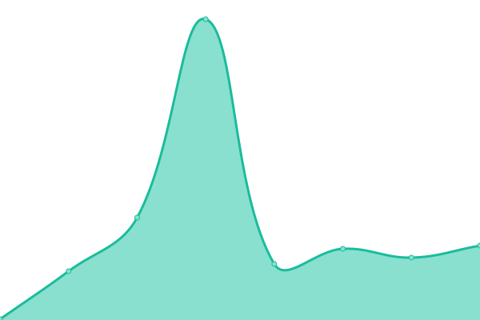
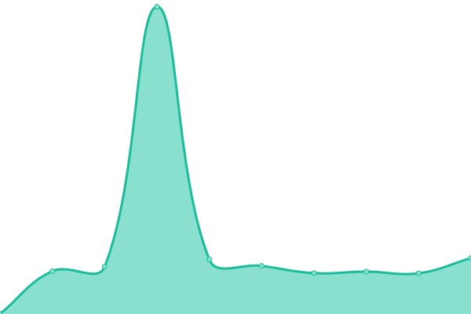
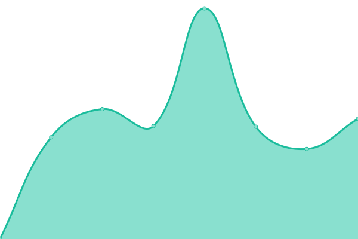

# [📈 Live Status](https://Test.github.io//Monitor): <!--live status--> **🟧 Partial outage**

This repository contains the open-source uptime monitor and status page for [Test](https://Test.github.io//Monitor), powered by [Upptime](https://github.com/upptime/upptime).

With [Upptime](https://upptime.js.org), you can get your own unlimited and free uptime monitor and status page, powered entirely by a GitHub repository. We use [Issues](https://github.com/Test//Monitor/issues) as incident reports, [Actions](https://github.com/Test//Monitor/actions) as uptime monitors, and [Pages](https://Test.github.io//Monitor) for the status page.

<!--start: status pages-->
<!-- This summary is generated by Upptime (https://github.com/upptime/upptime) -->
<!-- Do not edit this manually, your changes will be overwritten -->
<!-- prettier-ignore -->
| URL | Status | History | Response Time | Uptime |
| --- | ------ | ------- | ------------- | ------ |
|  [Google](https://www.google.com) | 🟩 Up | [google.yml](https://github.com/RobinsonOrregoT/Monitor/commits/HEAD/history/google.yml) | 

 75ms
     
 | 

<a href="https://RobinsonOrregoT.github.io/Monitor/history/google">100.00%</a>
    

|  Private SS | 🟩 Up | [private-ss.yml](https://github.com/RobinsonOrregoT/Monitor/commits/HEAD/history/private-ss.yml) | 

 596ms
     
 | 

<a href="https://RobinsonOrregoT.github.io/Monitor/history/private-ss">100.00%</a>
    

|  Private CSS | 🟩 Up | [private-css.yml](https://github.com/RobinsonOrregoT/Monitor/commits/HEAD/history/private-css.yml) | 

 613ms
     
 | 

<a href="https://RobinsonOrregoT.github.io/Monitor/history/private-css">100.00%</a>
    

|  Private MSS | 🟥 Down | [private-mss.yml](https://github.com/RobinsonOrregoT/Monitor/commits/HEAD/history/private-mss.yml) | 

 0ms
     
 | 

<a href="https://RobinsonOrregoT.github.io/Monitor/history/private-mss">0.00%</a>
    

|  Private PAC | 🟩 Up | [private-pac.yml](https://github.com/RobinsonOrregoT/Monitor/commits/HEAD/history/private-pac.yml) | 

 695ms
     
 | 

<a href="https://RobinsonOrregoT.github.io/Monitor/history/private-pac">100.00%</a>
    

|  Private Personal | 🟩 Up | [private-personal.yml](https://github.com/RobinsonOrregoT/Monitor/commits/HEAD/history/private-personal.yml) | 

 329ms
     
 | 

<a href="https://RobinsonOrregoT.github.io/Monitor/history/private-personal">100.00%</a>
    

<!--end: status pages-->

[**Visit our status website →**](https://Test.github.io//Monitor)

## 📄 License

- Powered by: [Upptime](https://github.com/upptime/upptime)
- Code: [MIT](./LICENSE) © [Test](https://Test.github.io//Monitor)
- Data in the `./history` directory: [Open Database License](https://opendatacommons.org/licenses/odbl/1-0/)
